# Global Project Plan

## 1. Project Purpose

This project implements an MVP-level machine learning system for **2x video frame interpolation**. The final system should accept a short video, synthesize intermediate frames between neighboring frames, and return a new video with doubled frame rate.

The project is not limited to a standalone neural network. It is planned as a staged ML system that includes:

- dataset preparation;
- dataset versioning;
- model training and fine-tuning;
- model evaluation and candidate validation;
- experiment tracking and model registry;
- local video inference (for development);
- production-style inference serving;
- asynchronous job processing;
- online quality tracking;
- controlled model fine-tuning based on newly collected data;
- a minimal web interface for demonstration.

The main engineering goal is to build a working, inspectable, reproducible MVP rather than a large-scale production system.

---

## 2. Target User Scenario

The final service should support the following user scenario:

1. A user opens a web page.
2. The user uploads a short video.
3. The backend validates the file.
4. A processing task is created.
5. The inference service generates intermediate frames.
6. The output video is assembled and stored temporarily.
7. The user receives a download link.
8. The system records request metadata and quality metrics.
9. Selected triplets may be saved for future fine-tuning.

The service is asynchronous. It does not promise real-time processing.

---

## 3. Scope and Global Constraints

### 3.1 MVP Scope

The MVP is designed for a university lab project. The system should be functional, demonstrable, and reasonably close to production design, but it is not expected to handle high traffic or fully automated cloud-scale deployment.

### 3.2 Input Constraints

The online service is planned around short user videos:

- maximum duration: 20 seconds;
- maximum file size: 50 MB;
- main output mode: 2x FPS.

### 3.3 Training Constraints

Training and fine-tuning are performed for **2x interpolation only**. Other interpolation modes such as 4x, 8x, or arbitrary timestamp interpolation may be added only for inference if supported by the selected model, but they are not part of the core training pipeline.

### 3.4 Deployment Constraints

The MVP assumes local or self-managed deployment:

- Docker Compose is the default deployment tool.
- Kubernetes is not part of the MVP.
- PostgreSQL, MinIO, MLflow, Redis, BentoML, backend services, and workers are expected to run on one local/server machine first.
- Cloud S3 is not used in the MVP; MinIO is used as the local S3-compatible object store.

---

## 4. Main Technology Stack

The project-wide technology stack is:

- Python;
- PyTorch;
- torchvision;
- OpenCV;
- Pillow;
- PyAV;
- PySceneDetect;
- FFmpeg;
- pandas / numpy;
- MLflow;
- BentoML;
- FastAPI;
- Celery;
- Redis;
- PostgreSQL;
- SQLAlchemy;
- psycopg[binary];
- Pydantic / pydantic-settings;
- python-dotenv;
- Typer;
- Rich;
- tqdm;
- Docker Compose;
- MinIO;
- uv;
- ruff;
- pytest.

### Tool Responsibilities

- **PyTorch** is used for model training, fine-tuning, evaluation, and local inference.
- **MLflow** is used for experiment tracking, metrics, artifacts, and model registry.
- **BentoML** is used for production-style model serving and inference API packaging.
- **FastAPI** is used for non-inference web backend logic: user requests, validation, status, metadata, and orchestration.
- **Celery + Redis** are used for asynchronous task processing.
- **PostgreSQL** stores application metadata and MLflow metadata.
- **MinIO** stores object artifacts: uploads, outputs, training data, and MLflow artifacts.
- **Docker Compose** is used to run infrastructure and services.

---

## 5. Model Strategy

The project uses cloned external model repositories as model implementation sources. These repositories are treated as external modules that may be carefully adapted to work inside the project pipeline.

Current model repositories:

```text
model_repos/
  AMT/
  EMA-VFI/
  Practical-RIFE/
```

Current pretrained weights:

```text
model_weights/
  AMT/
  EMA-VFI/
  Practical-RIFE/
```

### Required Models

The project must eventually support three selected VFI models:

1. **EMA-VFI**, with EMA-VFI-small used as the first integration target.
2. **AMT-S**.
3. **Practical-RIFE**.

### Integration Order

The implementation should first build a complete working pipeline with **EMA-VFI-small** only. After the full data → training/evaluation → inference route works with the first model, AMT-S and Practical-RIFE should be integrated using the same pipeline abstractions.

This order is important: the first goal is a working end-to-end prototype, not simultaneous partial integration of multiple models.

### Training Mode

The main training mode is **fine-tuning / transfer learning** from pretrained weights. Training from scratch may be supported as an optional mode, but it is not the primary path for the MVP.

---

## 6. Data Strategy

### 6.1 Core Data Unit

The core supervised data unit is a triplet:

```text
im1.png  -> left/input frame
im2.png  -> target middle frame
im3.png  -> right/input frame
```

The model learns to synthesize `im2` from `im1` and `im3` with `t = 0.5`.

### 6.2 Main Datasets

The project uses the following datasets and data sources:

- **Vimeo-90K Triplet** as the main base dataset.
- **Local animation videos** as an optional domain adaptation source.


### 6.3 Dataset Storage Principle

The canonical training data format is:

```text
PNG frames + CSV/YAML manifests
```

The MVP must not use decoded tensors as the canonical dataset format. WebDataset is not part of the initial MVP.

Dataset manifests must use relative paths. Absolute local paths and S3 URIs must not be written into manifests. A runtime `DATASET_ROOT` is used to resolve local paths.

### 6.4 Dataset Versions

Dataset versions are represented by manifest/config artifacts rather than physical copies of all image files.

A dataset version contains:

```text
train_all.csv
val_all.csv
test_all.csv
dataset_config.yaml
```

Splits are logical. Image files are not moved into physical train/val/test folders.

To avoid leakage, splitting must happen at the level of source video, clip, episode, or another high-level source grouping, not at the level of individual triplets.

---

## 7. High-Level Architecture

The final system is organized into the following logical layers:

1. **Access Layer**
   - User / Browser
   - Frontend UI
   - FastAPI Backend

2. **Orchestration and Scheduling**
   - Celery task queue
   - scheduler
   - trigger monitor
   - dataset version builder

3. **Compute and Serving Layer**
   - BentoML inference service for the active production model;
   - training / retraining worker;
   - candidate validation;
   - local dataset cache.

4. **Storage and Model Management**
   - PostgreSQL application database
   - PostgreSQL MLflow database
   - MinIO object storage
   - MLflow tracking server and model registry
   - BentoML Model Store for approved release models

5. **Dataset Sources**
   - Vimeo-90K Triplet
   - Local videos
   - dataset preprocessing

The primary serving pattern is **one BentoML service and one runner for one active production model**. In a multi-GPU demo or extension, multiple active models may be deployed as separate BentoML services, each with its own runner and GPU assignment. Dynamic switching between several large models inside one runner is not the MVP strategy.

---

## 8. Architecture Diagram

```mermaid
%%{
  init: {
    "flowchart": {
      "curve": "basis",
      "nodeSpacing": 30,
      "rankSpacing": 40,
      "padding": 15
    },
    "themeVariables": {
      "fontSize": "16px"
    }
  }
}%%

flowchart LR

    %% =========================
    %% TIER 1: CLIENT & ACCESS
    %% =========================
    subgraph ClientLayer["Access Layer"]
        direction LR
        U@{ shape: docs, label: "User / Browser" }
        UI@{ shape: lean-r, label: "Frontend UI" }
        API@{ shape: fr-rect, label: "FastAPI Backend" }

        U <--> UI
        UI <-->|"upload video / poll status"| API
    end

    %% =========================
    %% TIER 2: ORCHESTRATION
    %% =========================
    subgraph Orchestration["Orchestration & Scheduling"]
        direction LR
        Q@{ shape: h-cyl, label: "Celery Task Queue" }

        subgraph RetrainLogic["Retraining Logic"]
            direction TB
            SCHED@{ shape: fr-rect, label: "Scheduler" }
            TRIG@{ shape: fr-rect, label: "Trigger Monitor" }
            DVB@{ shape: fr-rect, label: "Dataset Version Builder" }

            SCHED -.->|"run trigger check"| TRIG
            TRIG -->|"trigger fired"| DVB
        end
    end

    %% =========================
    %% TIER 3: COMPUTE
    %% =========================
    subgraph ComputeLayer["Compute Layer"]
        direction LR

        subgraph WN["Worker Node (*N)"]
            direction TB
            IW@{ shape: fr-rect, label: "BentoML Inference Service\n(active model)" }
            TW@{ shape: fr-rect, label: "Training / Retraining Worker" }
            CV@{ shape: fr-rect, label: "Candidate Validation" }
            LC@{ shape: win-pane, label: "Local Dataset Cache" }

            LC -->|"dataset version"| TW
            TW -->|"candidate model"| CV
        end
    end

    %% =========================
    %% TIER 4: PERSISTENCE & MLOPS
    %% =========================
    subgraph Persistence["Storage & Model Management"]
        direction LR

        subgraph PG["PostgreSQL"]
            direction TB
            APPDB@{ shape: cyl, label: "Application DB" }
            MLFDB@{ shape: cyl, label: "MLflow DB" }
        end

        subgraph OBJ["MinIO"]
            direction TB
            UP@{ shape: cyl, label: "uploads-temp" }
            OUT@{ shape: cyl, label: "outputs-temp" }
            TDS@{ shape: cyl, label: "training-data" }
            MLFA@{ shape: cyl, label: "mlflow-artifacts" }
        end

        subgraph MLOps["MLflow / Model Management"]
            direction TB
            MLF@{ shape: fr-rect, label: "MLflow Server" }
            MR@{ shape: fr-rect, label: "Model Registry" }
        end
    end

    %% =========================
    %% DATA SOURCES
    %% =========================
    subgraph Sources["Dataset Sources"]
        direction TB
        V@{ shape: docs, label: "Vimeo-90K Triplet" }
        A@{ shape: docs, label: "Adobe240 / GoPro /\nlocal videos" }
        PREP@{ shape: fr-rect, label: "Dataset Preprocessing" }

        V -->|"base triplets"| TDS
        A -->|"raw videos"| PREP
        PREP -->|"triplets / manifests"| TDS
    end

    %% =========================
    %% CRITICAL CONNECTIONS
    %% =========================

    %% App → Queue / Storage
    API -->|"request metadata"| APPDB
    API -->|"input video"| UP
    API -->|"enqueue inference task"| Q

    %% Queue → workers
    Q -.->|"inference task"| IW
    Q -.->|"training task"| TW

    %% Inference worker ↔ storage / model registry
    IW -->|"read input video"| UP
    MR -->|"approved model reference"| IW
    IW -->|"write output video"| OUT
    IW -->|"request status / online metrics"| APPDB
    IW -->|"selected triplets"| TDS

    %% Output delivery
    OUT -->|"result link"| API
    API -->|"status / result link"| UI

    %% Trigger logic
    APPDB -.->|"online quality history"| TRIG
    MLFA -.->|"offline benchmark metrics"| TRIG

    %% Dataset building and sync
    TDS -->|"datasets / packages"| DVB
    DVB -->|"dataset version manifests"| TDS
    TDS -->|"sync dataset version"| LC

    %% Training / validation
    TW -->|"run logs / metrics"| MLF
    TW -->|"candidate model"| CV
    CV -->|"approved model"| MR
    CV -->|"validation results"| MLF
    CV -->|"benchmark metrics"| MLFA

    %% MLflow persistence
    MLF -->|"tracking metadata"| MLFDB
    MLF -->|"artifacts"| MLFA
    MR -->|"model metadata"| MLFDB
    MR -->|"model artifacts"| MLFA

    %% =========================
    %% STYLES
    %% =========================
    classDef actor fill:#e3f2fd,stroke:#1e88e5,color:#0d47a1,font-size:24px;
    classDef service fill:#f3e5f5,stroke:#8e24aa,color:#4a148c,font-size:24px;
    classDef store fill:#e8f5e9,stroke:#43a047,color:#1b5e20,font-size:24px;
    classDef queue fill:#fff3e0,stroke:#fb8c00,color:#e65100,font-size:24px;
    classDef helper fill:#eceff1,stroke:#546e7a,color:#263238,font-size:24px;

    class U,V,A actor;
    class UI,API,PREP,IW,TW,MLF,MR,TRIG,DVB,CV,SCHED service;
    class APPDB,MLFDB,UP,OUT,TDS,MLFA store;
    class Q queue;
    class LC helper;

    style ClientLayer fill:#e3f2fd,stroke:#1e88e5,stroke-dasharray:5 5,stroke-width:2px
    style Orchestration fill:#fff3e0,stroke:#fb8c00,stroke-dasharray:5 5,stroke-width:2px
    style RetrainLogic fill:#fff8e1,stroke:#fb8c00,stroke-dasharray:3 3,stroke-width:2px
    style ComputeLayer fill:#f3e5f5,stroke:#8e24aa,stroke-dasharray:5 5,stroke-width:2px
    style WN fill:#faf5ff,stroke:#ab47bc,stroke-dasharray:3 3,stroke-width:2px

    style Persistence fill:#f1f8e9,stroke:#43a047,stroke-dasharray:5 5,stroke-width:2px
    style PG fill:#ffffff,stroke:#7cb342,stroke-dasharray:3 3,stroke-width:2px
    style OBJ fill:#ffffff,stroke:#43a047,stroke-dasharray:3 3,stroke-width:2px
    style MLOps fill:#ede7f6,stroke:#673ab7,stroke-dasharray:3 3,stroke-width:2px
    style Sources fill:#f5f5f5,stroke:#616161,stroke-dasharray:5 5,stroke-width:2px
```



---

## 9. Model Lifecycle and Serving Strategy

The model lifecycle is divided into three separate concerns.

### 9.1 Training and Experimentation

Training scripts save checkpoints, metrics, configs, and artifacts to MLflow. MLflow is the source of truth for training history, candidate models, validation results, and approved model versions.

### 9.2 Release for Inference

Only approved models are exported from MLflow to the BentoML Model Store. BentoML is then used to build and run the production-style inference service.

The intended release flow is:

```text
training script
  -> MLflow run + MLflow Model Registry
  -> candidate validation
  -> approved model version
  -> release script loads approved model from MLflow
  -> save model to BentoML Model Store
  -> build BentoML service image
  -> run inference service
```

FastAPI does not directly serve neural network inference. FastAPI orchestrates user requests and metadata; BentoML owns model inference APIs.

### 9.3 Adapter-Based Serving

Model-specific inference logic must remain inside model adapters. BentoML services must not duplicate model-specific preprocessing, tensor formatting, checkpoint loading rules, runtime calls, or postprocessing.

The intended serving call chain is:

```text
BentoML Service / Runner
  -> ModelAdapter.predict_batch()
  -> PyTorch runtime first
  -> ONNX Runtime later if exported model is available
```

A BentoML custom Runnable/Runner should create the adapter inside the runner process from configuration and BentoML Model Store references. A ready-made adapter instance should not be passed into the runner from outside, because model weights, CUDA context, and ONNX sessions must be created inside the serving process.

The adapter public prediction API must remain stable:

```text
predict_pair()
predict_batch()
predict()
__call__()
```

Stage 1 uses PyTorch inference through adapters. ONNX export and ONNX Runtime inference are later serving optimizations and must not be required for Stage 1.

### 9.4 Active Model Deployment Policy

Primary MVP serving mode:

```text
one BentoML service
one runner
one active production model
```

Multi-GPU extension:

```text
one BentoML service per active model
one runner inside each service
one GPU assignment per service/container
```

This avoids dynamic loading and unloading of large VFI models inside one process and keeps GPU memory management simple.

---

## 10. Data Flow Summary

The final data flow consists of four major flows.

### 10.1 Static Dataset Flow

```text
external datasets / local videos
  -> dataset preprocessing
  -> training-data storage
  -> global index
  -> dataset version
  -> local worker cache
  -> training / fine-tuning
```

### 10.2 User Inference Flow

```text
user upload
  -> FastAPI validation
  -> uploads-temp storage
  -> Celery inference task
  -> inference worker / BentoML model service
  -> outputs-temp storage
  -> user download link
```

### 10.3 Online Quality Flow

```text
processed request
  -> sampled quality evaluation
  -> online quality history
  -> trigger monitor
```

### 10.4 Fine-Tuning Flow

```text
new online packages + base data
  -> dataset version builder
  -> training worker
  -> MLflow tracking
  -> candidate validation
  -> MLflow Model Registry
  -> BentoML Model Store after approval
```

---

## 11. Planned Project Stages

## Stage 1 — ML Core

Goal: build a local, reproducible ML core before implementing the web service.

Main outputs:

- dataset preprocessing from raw videos to sampled frame sequences;
- global dataset index;
- dataset version builder;
- PyTorch dataset for triplet manifests;
- baseline evaluation;
- EMA-VFI-small end-to-end integration first;
- later AMT-S and Practical-RIFE integration;
- training / fine-tuning runner from pretrained weights;
- candidate validation;
- MLflow tracking;
- local 2x video inference.

Stage 1 is local-first. It does not require FastAPI, Celery, PostgreSQL application DB, or frontend. MLflow infrastructure may already run in Docker Compose with PostgreSQL and MinIO.

## Stage 2 — Inference Service Backend

Goal: wrap local inference into a service-oriented backend.

Main outputs:

- BentoML model service for one active production model;
- custom BentoML Runnable/Runner that calls the model adapter public prediction API;
- BentoML Model Store integration;
- release script that exports an approved MLflow model version into BentoML Model Store;
- FastAPI backend for upload, validation, status, result links, and orchestration;
- Celery + Redis task queue;
- MinIO buckets for uploads and outputs;
- PostgreSQL application tables for requests and quality history;
- Docker Compose runtime for local service deployment.

The first backend implementation should run one active model. If multiple GPUs are available for demonstration, the extension strategy is to run separate BentoML services for separate active models, each with its own runner and GPU assignment.

## Stage 3 — Data Collection and Fine-Tuning Automation

Goal: connect online usage with controlled model adaptation.

Main outputs:

- sampled online quality evaluation;
- online quality history;
- export of selected triplets into retraining pool;
- data accumulation trigger;
- quality drift trigger;
- training queue;
- worker role policy;
- candidate validation integrated with retraining;
- MLflow-to-BentoML promotion path.

## Stage 4 — Frontend, Monitoring, and Demonstration

Goal: provide a complete user-facing demo and operational demonstration.

Main outputs:

- minimal frontend UI;
- upload form;
- processing status view;
- download link;
- basic service monitoring;
- alert conditions and runbooks;
- controlled degradation demo;
- artificial trigger activation;
- demonstration of model fine-tuning pipeline behavior.

---

## 12. Persistent Storage Plan

The MVP uses local infrastructure services first.

### PostgreSQL

One PostgreSQL instance may contain multiple logical databases:

- application database;
- MLflow database.

Application database tables are expected to include at least:

- `requests`;
- `online_quality_history`.

Additional tables may be added in later stages for dataset versions, training runs, worker status, and service state.

### MinIO

MinIO is the local object store.

Expected buckets:

- `uploads-temp` — temporary input videos;
- `outputs-temp` — temporary processed videos;
- `training-data` — base datasets, generated datasets, online packages, dataset versions;
- `mlflow-artifacts` — MLflow artifacts, checkpoints, metrics, model files.

### MLflow

MLflow stores:

- experiment metadata;
- training runs;
- metrics;
- configs;
- artifacts;
- model registry entries.

### BentoML

BentoML stores approved release models in its own Model Store. This store is used for serving models in the inference service.

---

## 13. Global Development Rules

1. Build the ML core first; do not start from the frontend.
2. Make every major pipeline step runnable from CLI or a Python function.
3. Prefer clear configs over hardcoded values.
4. Use MLflow for experiment tracking from the first training stage.
5. Use BentoML for production-style inference serving, not FastAPI.
6. Use FastAPI for application orchestration, not direct model inference.
7. Keep model-specific inference logic inside model adapters.
8. Keep BentoML serving wrappers thin: they should call adapter prediction methods.
9. Keep data manifests path-portable through relative paths.
10. Avoid premature cloud infrastructure and Kubernetes.
11. Keep the MVP simple enough to run on one self-managed machine.
12. Add complexity only after a working local path exists.

---

## 14. Final Target State

At the end of the project, the repository should support the following complete lifecycle:

```text
prepare data
  -> build dataset version
  -> train / fine-tune model
  -> validate candidate
  -> track experiment in MLflow
  -> release approved model to BentoML
  -> run inference service
  -> accept user videos
  -> process videos asynchronously
  -> store metrics
  -> collect selected triplets
  -> trigger fine-tuning when enough new data is accumulated or drift is detected
```

The project is successful if it demonstrates a working video interpolation service and a reproducible model lifecycle, even if the service runs only as an MVP on limited hardware.
